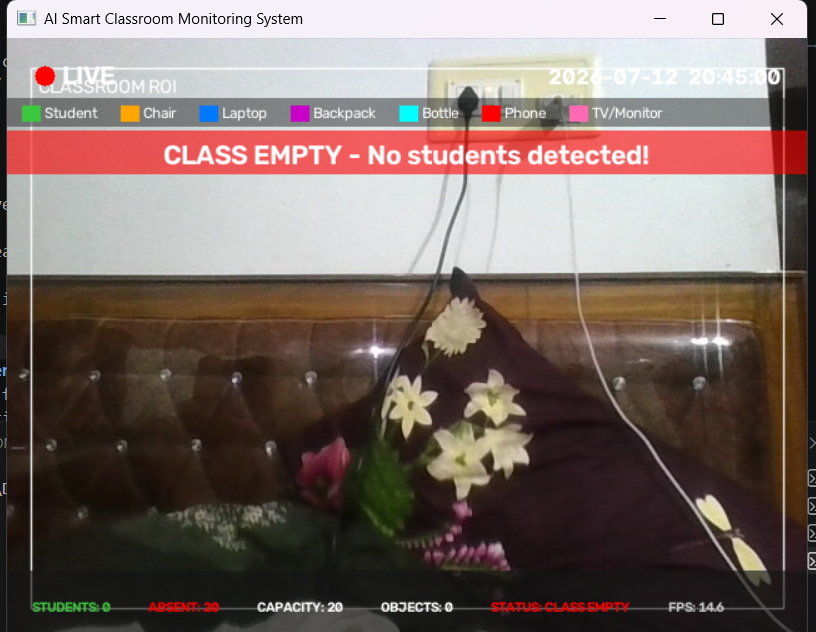
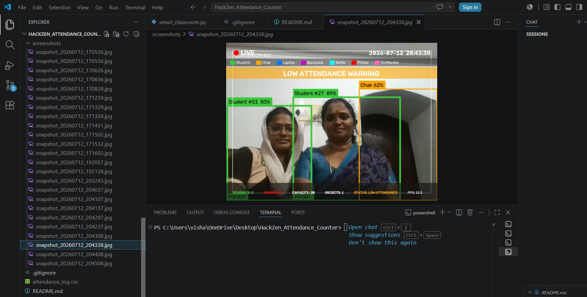
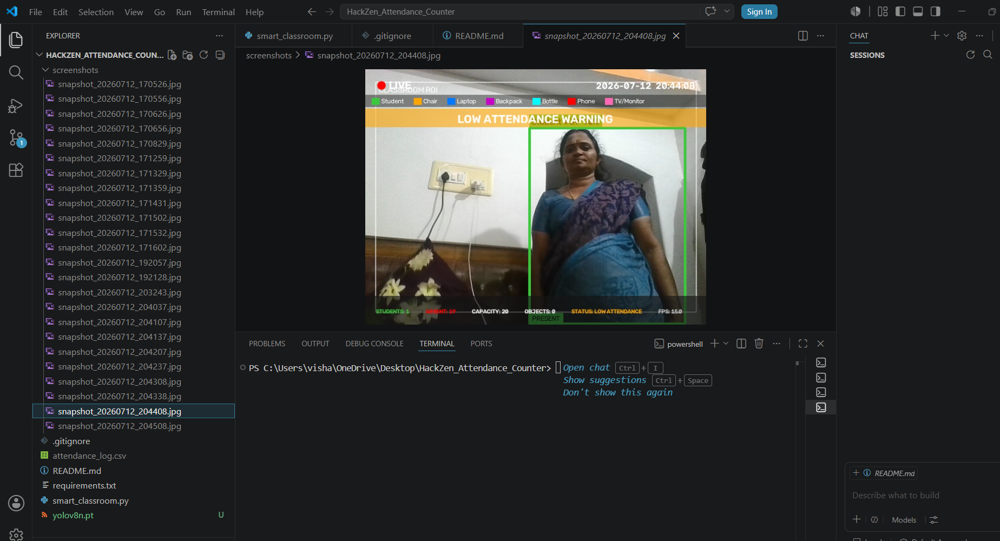
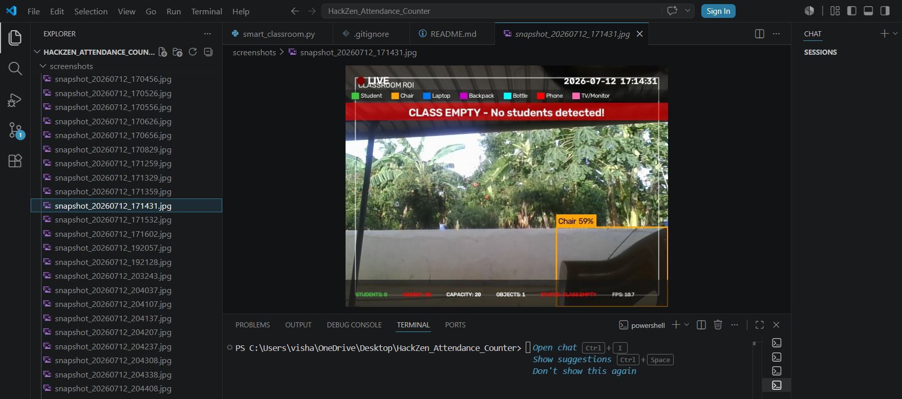

# 🎓 AI Smart Classroom Monitoring System

## 📌 Overview

AI Smart Classroom Monitoring System is a real-time computer vision application developed using YOLOv8 and OpenCV. It automatically detects students and classroom objects, monitors attendance, generates alerts, captures screenshots, and logs attendance data for analysis.

The system is designed to reduce manual classroom monitoring while improving accuracy and efficiency.

## Team Members
- Vishalakshi V S
- Suroopika D
- Kodhanya D

## Problem Statement
Manual attendance consumes valuable classroom time and may lead to human errors. An automated attendance counting system can reduce effort and provide quick classroom occupancy information.

## Solution
This project uses the YOLOv8 Computer Vision model to detect people in a live webcam feed and count the number of students present in the classroom.

## ✨ Features

- 🎯 Real-time student detection using YOLOv8
- 👨‍🎓 Live student attendance counting
- 🪑 Classroom object detection (Chair, Laptop, Backpack, Bottle, Phone, TV/Monitor)
- 🔄 ByteTrack-based student tracking (prevents duplicate counting)
- 📊 Live attendance dashboard
- 🚨 Smart alerts for:
  - Empty classroom
  - Low attendance
  - Overcrowding
- 📸 Automatic screenshot capture during important events
- 📝 CSV attendance logging with timestamps
- ⏰ Live date and time display
- 📦 Classroom ROI (Region of Interest) monitoring
- ⚡ Real-time FPS display
- 🎥 Webcam and video file support

## 🛠️ Technologies Used

| Technology           | Purpose |
|----------------------|--------------------------------------|
| Python               | Core programming language            |
| OpenCV               | Image processing and video streaming |
| YOLOv8 (Ultralytics) | Real-time object detection           |
| ByteTrack            | Multi-object tracking                |
| NumPy                | Numerical computations               |
| CSV                  | Attendance data logging              |
| PyTorch              | Deep learning backend for YOLOv8     |
| VS Code              | Development environment              |

## ▶️ How to Run

1. Clone the repository

```bash
git clone https://github.com/vishalakshisanjeevkumar-13/AI-Smart-Classroom-Monitoring-System
```

2. Navigate to the project folder

```bash
cd AI-Smart-Classroom-Monitoring-System
```

3. Install the required dependencies

```bash
pip install -r requirements.txt
```

4. Run the application

```bash
python smart_classroom.py
```

## 📂 Project Structure

AI-Smart-Classroom-Monitoring-System/
│── smart_classroom.py
│── requirements.txt
│── README.md
│── .gitignore
│── LICENSE
│── screenshots/
│── attendance_log.csv (Generated Automatically)
│── classroom_logs/ (Generated Automatically)


## 📜 License

This project is developed for the HackZen 2026 Hackathon.

Copyright © 2026 Team Members.

This repository is intended for educational and demonstration purposes.


## Future Enhancements
- Face recognition for individual attendance
- Database integration
- Automatic attendance reports
- Multi-camera support
- Classroom analytics dashboard

## 📸 Project Screenshots

### 🖥️ Dashboard



---

### 👨‍🎓 Student Detection



---

### 📊 Attendance Counter



---

### 🚨 Alert Banner

